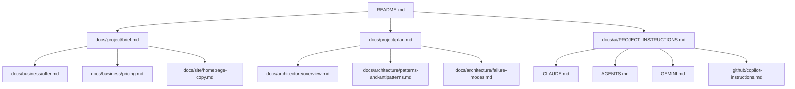
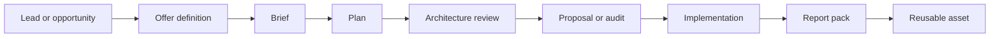

# vertexchaos-site

Astro-based marketing site for Vertex Chaos, plus the working project skeleton for agent instructions, architecture notes, business packaging, and Day-1 execution planning.

## Purpose

This repo now serves two jobs:
- the public-facing `vertexchaos.com` website
- the internal operating template for productized consulting offers, AI agent setup, and architecture-first delivery

The repo already contains the website implementation, including Astro app structure under `src/`, homepage code in `src/pages/index.astro`, and brand config in `src/config/site.ts`. The scaffold adds reusable docs, cross-agent instruction files, project prompts, and an operating plan so the site repo can double as the active working system.

## What this repo now contains

```text
.
├── .github/
│   ├── copilot-instructions.md
│   └── instructions/
│       ├── docs.instructions.md
│       ├── powershell.instructions.md
│       └── python.instructions.md
├── .vscode/
│   ├── extensions.json
│   ├── settings.json
│   └── tasks.json
├── AGENTS.md
├── CLAUDE.md
├── GEMINI.md
├── README.md
├── docs/
│   ├── ai/
│   │   └── PROJECT_INSTRUCTIONS.md
│   ├── architecture/
│   │   ├── failure-modes.md
│   │   ├── overview.md
│   │   └── patterns-and-antipatterns.md
│   ├── business/
│   │   ├── delivery-checklist.md
│   │   ├── offer.md
│   │   └── pricing.md
│   ├── project/
│   │   ├── backlog.md
│   │   ├── brief.md
│   │   ├── decisions.md
│   │   ├── operator-commands.md
│   │   └── plan.md
│   └── site/
│       ├── brand-notes.md
│       └── homepage-copy.md
├── prompts/
│   ├── audit.md
│   ├── implementation.md
│   ├── proposal.md
│   └── report.md
├── scripts/
│   └── verify.ps1
├── src/
│   ├── config/site.ts
│   └── pages/index.astro
└── public/
```

## Documentation flow



## Delivery flow



## Architecture guardrails

Every project doc in this repo should answer:
- what holds truth?
- what moves work?
- what retries?
- what fails first?
- what shortcut was tempting?
- why was it rejected or temporarily tolerated?
- when does the design stop being good enough?

The most important explicit antipattern to track is `database-as-a-queue`.

## Agent file strategy

One canonical instructions file lives at:
- `docs/ai/PROJECT_INSTRUCTIONS.md`

Thin wrappers point tools at it:
- `CLAUDE.md`
- `AGENTS.md`
- `GEMINI.md`
- `.github/copilot-instructions.md`

## Day-1 outcome definition

A tool is only considered set up when it can:
1. read repo context
2. summarize structure accurately
3. create or edit one controlled file

## 90-minute operating mode

### Block 1: foundation
- review agent files and project docs
- verify Claude, Codex, and Gemini can read the repo
- perform one controlled doc edit with each tool

### Block 2: productization
- refine `docs/business/offer.md`
- refine `docs/business/pricing.md`
- refine `prompts/audit.md` and `prompts/proposal.md`

### Block 3: site credibility
- refine `docs/site/homepage-copy.md`
- then apply approved copy to `src/config/site.ts` and `src/pages/index.astro`

## Local dev

```powershell
npm install
npm run dev
```

## Build

```powershell
npm run build
npm run preview
```

## Verification

```powershell
powershell -ExecutionPolicy Bypass -File .\scripts\verify.ps1
```

## Recommended smoke tests

### Claude
- open repo
- summarize structure
- update `docs/project/plan.md` with one bullet

### Codex / ChatGPT coding agent
- open repo
- explain architecture files
- update `docs/project/backlog.md` with one task

### Gemini
- open repo
- summarize `docs/business/offer.md` and `docs/site/homepage-copy.md`
- add one improvement note to `docs/site/brand-notes.md`

## Operator commands

See:
- `docs/project/operator-commands.md`

## Important note

This scaffold is intentionally documentation-first. It prepares the repo for controlled execution, but it does not overwrite the public site implementation files yet. That happens after the copy and offer direction are approved.