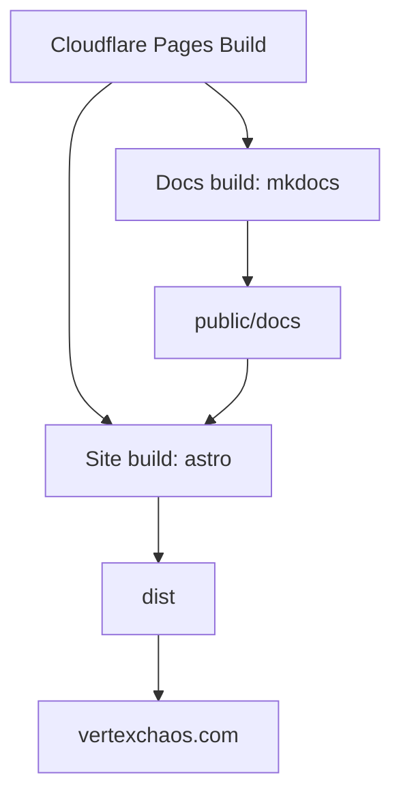

# Diagrams

## Component diagram



## Route map

```mermaid
graph LR
  R[/] --> P[index.astro]
  R2[/services] --> P2[services.astro]
  R3[/resume] --> P3[resume.astro]
  R4[/contact] --> P4[contact.astro]
  R5[/docs] --> P5[public/docs/index.html]
```

